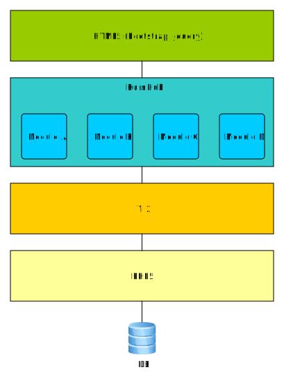

Application Overview
=======

Humhub is based on **PHP5** and **Yii2** and leverages the highly modular and flexible nature of *Yii*.
Before learning about the internals of HumHub, you should be familiar with the basic concepts of the
[Yii Framework](http://www.yiiframework.com/doc-2.0/guide-README.html "Yii Framework").
The HumHub core contains of several core modules as well as extended Yii components:

**Core Components:**

 - [[humhub\components\ActiveRecord]]:
 - [[humhub\components\Application]]
 - [[humhub\components\Controller]]
 - [[humhub\components\Migration]]
 - [[humhub\components\Module]]
 - [[humhub\components\ModuleManager]]
 - [[humhub\components\Request]]
 - [[humhub\components\Theme]]
 - [[humhub\components\View]]
 - [[humhub\components\Widget]]

**Core Modules:**

 - **activity:**  User/Space activities
 - **admin:**  Responsible for admin/configuration related issues
 - **comment:**  Content addon for commenting
 - **content:**  Base module for all content types (Post,Wiki,...) 
 - **dashboard:**  Dashboard related functionality
 - **directory:**  Directory related functionality
 - **file:**  Basic file module for accessing the filesystem
 - **installer:**  HumHub installer module
 - **like:**  Content addon for likes
 - **notification:**  User Notifications
 - **post:**  Simple user-post related functionality
 - **search:**  Luceene Search Module
 - **space:**  Space related functionality
 - **tour:**  HumHub user-guide
 - **user:**  Basic user module

